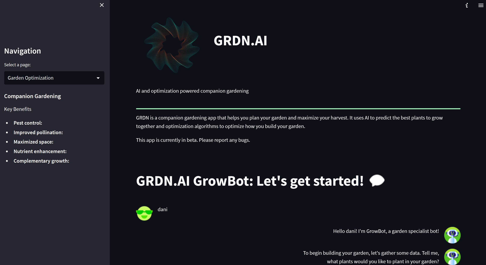
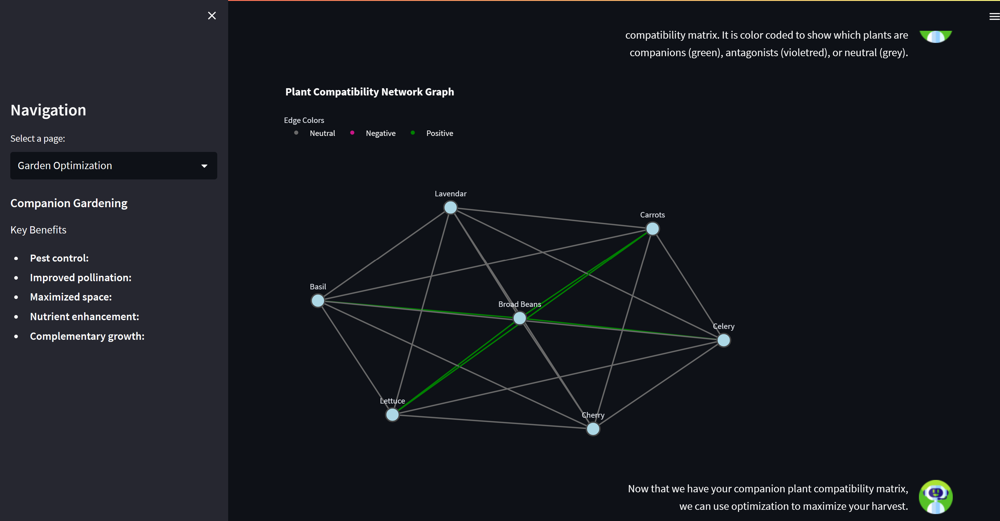
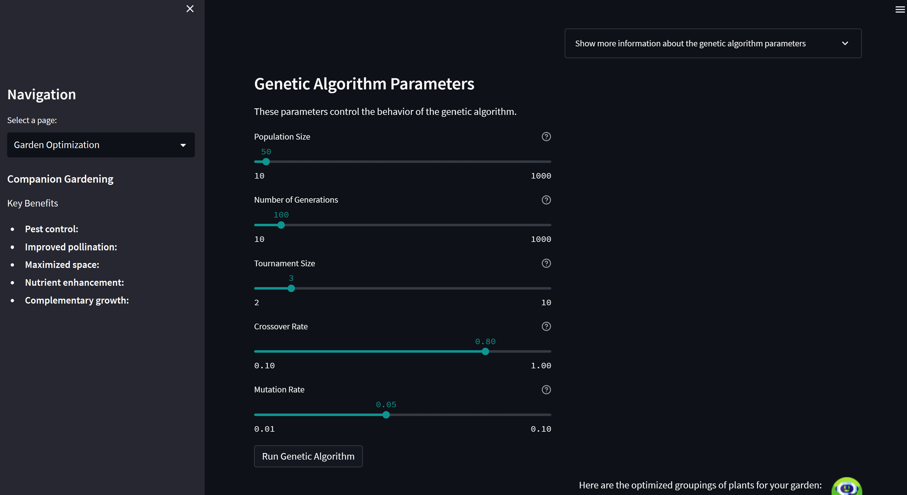
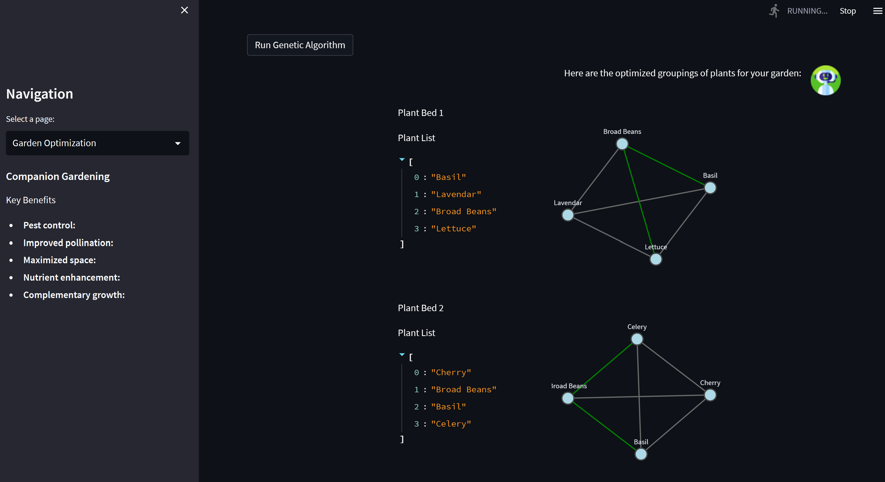
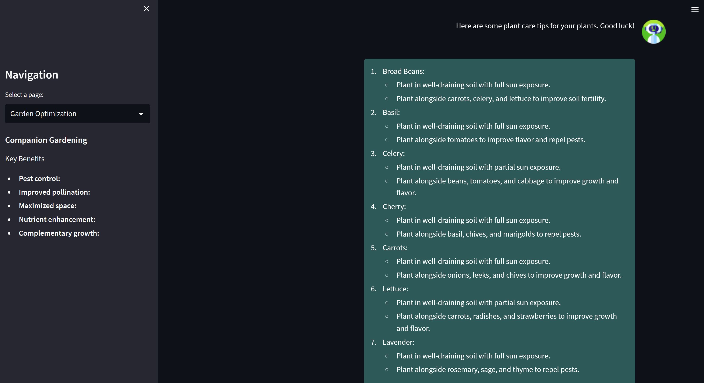

# README
 
 
 GRDN 🌱
 
author: Danielle Heymann
 
contact: dheymann314@gmail.com
 
last updated: 06/20/2023
 
 
GRDN is an application that allows users to optimize a garden and its plant beds through companion planting, generative AI, and optimization. It is a work in progress. 
 
 
 

## Background
info
 
 

 
 

 
 

 
 

 
 

 
 

## Setup
- setup conda environment 
  >*conda create --name=GRDN_env*
- install dependencies
  >*pip install -r requirements.txt*
- establish env vars for openai key
  >**COMING SOON- to be added shortly**

## Running App
- navigate to ...GRDN/src
- activate environment
  >*conda activate GRDN_env*
- run app
  >*python -m streamlit run app.py*
  
## Software, data, and libraries used
### Libraries and Software
- Python
- streamlit
- openai
- plotly
- pandas
- numpy
- PIL
- langchain
- streamlit_chat
- github copilot
- chatGPT
- GPT family of models

### Data sources in addition to what GPT was trained on: https://waldenlabs.com/the-ultimate-companion-planting-guide-chart/
### avatars from: https://www.flaticon.com/free-icons/bot

