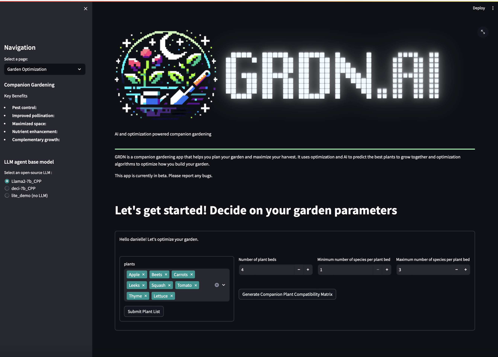
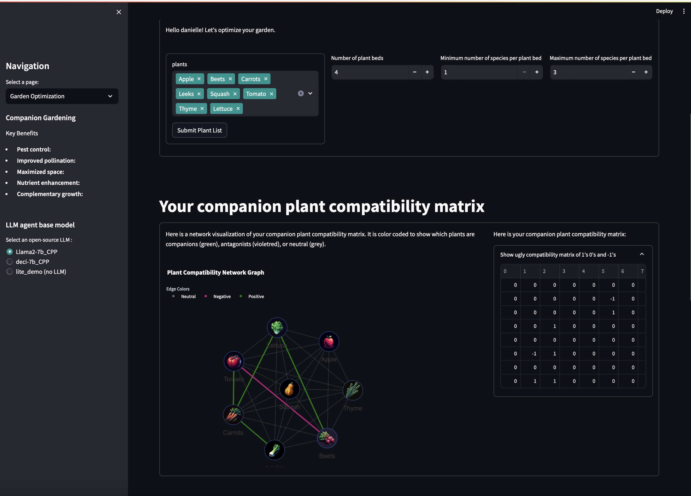
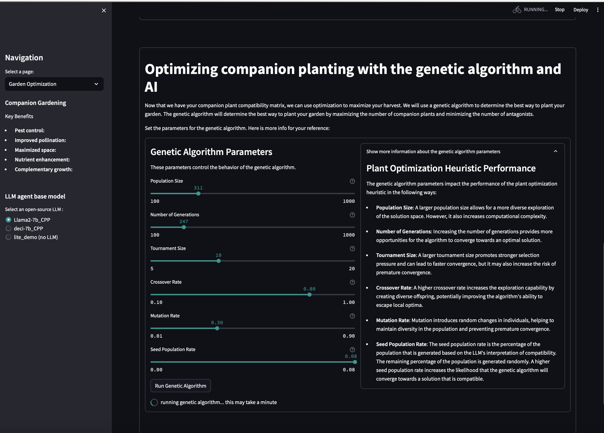
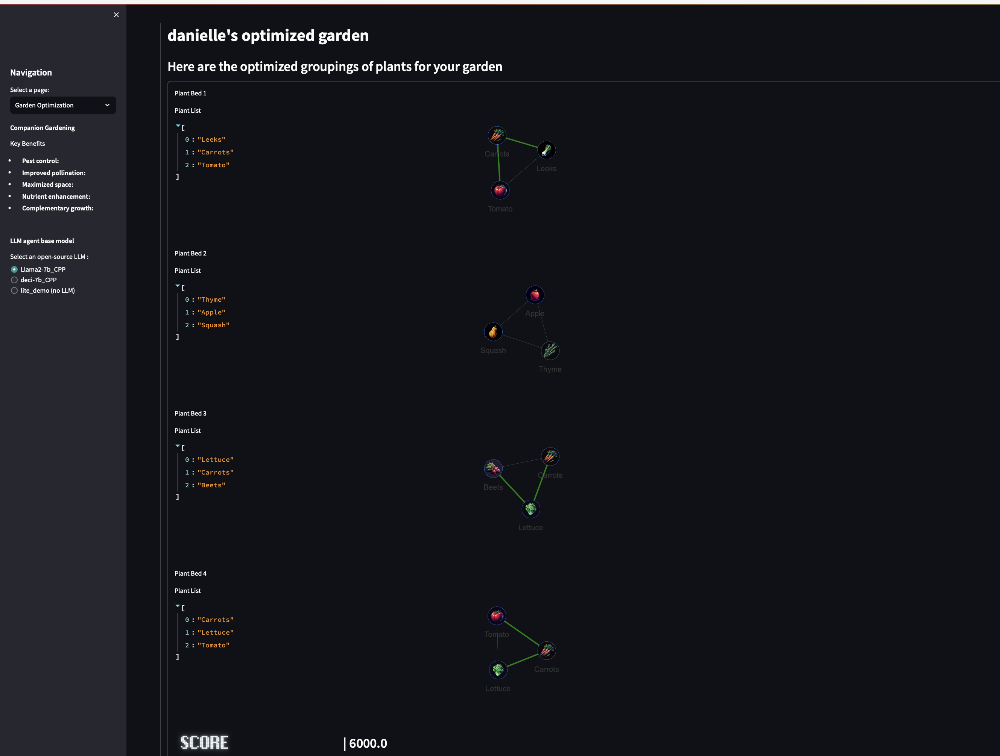
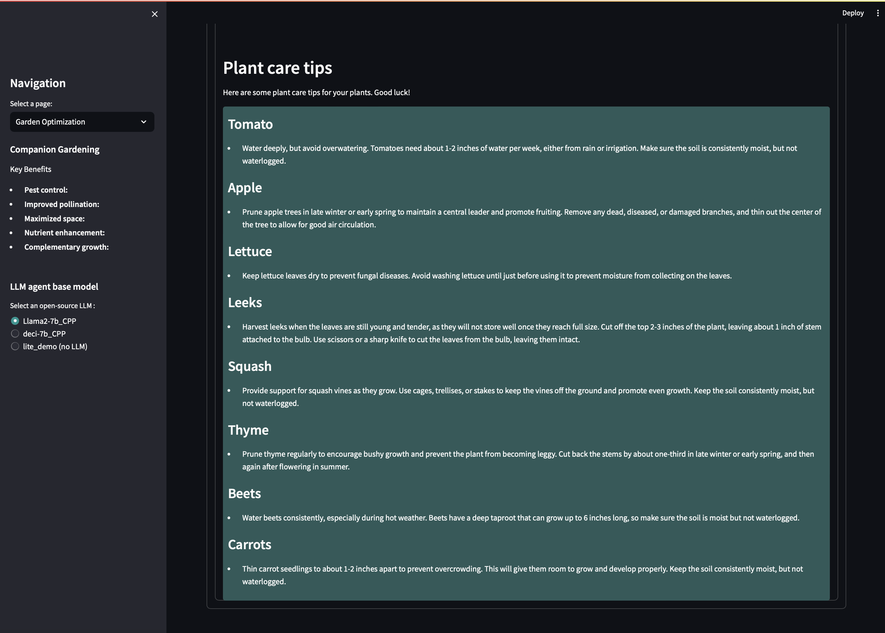
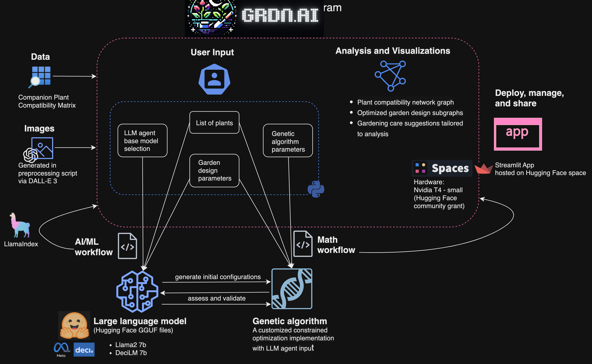

# README
 
 
 GRDN 🌱
 
author: Danielle Heymann
 
contact: dheymann314@gmail.com
 
last updated: 12/31/2023
 
 
GRDN is an application that allows users to optimize a garden and its plant beds through companion planting, generative AI, and optimization. It is a work in progress. 
 
 
Note: this is in beta and is in experimentation mode. 
 

## Background
info
 
 

 
 

 
 

 
 

 
 

 
 

## Tech Stack

 
 

## Setup
- setup conda environment 
  >*conda create --name=GRDN_env*
- install dependencies
  >*pip install -r requirements.txt*
- download local models and add them to model folder
  >I used LLama2 7B HF Chat model and DeciLM 7B instruct model
  >https://huggingface.co/TheBloke/Llama-2-7B-Chat-GGUF/blob/main/llama-2-7b-chat.Q4_K_M.gguf
  >https://huggingface.co/Deci/DeciLM-7B-instruct-GGUF/tree/main

## Running App
- navigate to ...GRDN/src
- activate environment
  >*conda activate GRDN_env*
- run app
  >*python -m streamlit run app.py*
  
## Software, data, and libraries used
### Libraries and Software
- Python
- streamlit
- openai
- plotly
- pandas
- numpy
- PIL
- langchain
- streamlit_chat
- github copilot
- Llama2
- Deci AI
- HuggingFace
- LlamaIndex
- chatGPT
- GPT family of models
- DALL·E 3 (in preprocessing script for image generation)

### Data sources in addition to what GPT was trained on: https://waldenlabs.com/the-ultimate-companion-planting-guide-chart/
### avatars from: https://www.flaticon.com/free-icons/bot

